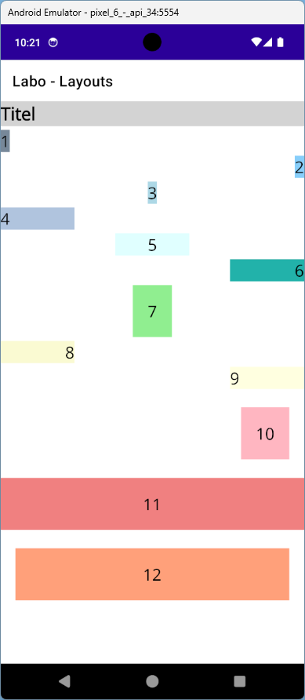
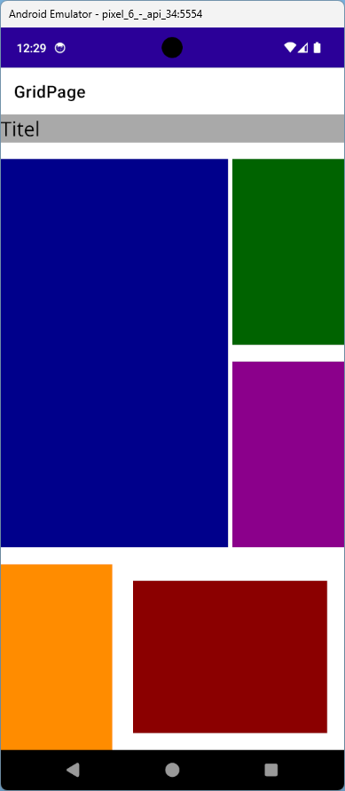

# Labo-Layouts

## Deel 1: StackLayout
- Voeg een StackLayout toe aan de MainPage
- Gebruik onderstaande labels om het voorbeeld zo goed mogelijk na te bouwen



```
<Label Text="Titel" FontSize="Title" FontAttributes="Bold" BackgroundColor="LightGray" />
<Label Text="1" FontSize="Large" BackgroundColor="LightSlateGrey"  />
<Label Text="2" FontSize="Large" BackgroundColor="LightSkyBlue"  />
<Label Text="3" FontSize="Large" BackgroundColor="LightBlue" />
<Label Text="4" FontSize="Large" BackgroundColor="LightSteelBlue" />
<Label Text="5" FontSize="Large" BackgroundColor="LightCyan" />
<Label Text="6" FontSize="Large" BackgroundColor="LightSeaGreen" />
<Label Text="7" FontSize="Large" BackgroundColor="LightGreen" />
<Label Text="8" FontSize="Large" BackgroundColor="LightGoldenrodYellow" />
<Label Text="9" FontSize="Large" BackgroundColor="LightYellow" />
<Label Text="10" FontSize="Large" BackgroundColor="LightPink" />
<Label Text="11" FontSize="Large" BackgroundColor="LightCoral" />
<Label Text="12" FontSize="Large" BackgroundColor="LightSalmon" />
```
> Tip: Gebruik de volgende eigenschappen:
>	- Spacing 
>	- Margin 
>	- Padding
>	- HorizontalOptions
>	- HorizontalTextAlignment
>	- WidthRequest

## Deel 2: GridLayout
- Voorzie in de MainPage een knop om te navigeren naar de GridPage
- Voeg op de GridPage een Grid layout toe met:
	- 4 rijen:
		- de eerste rij is even hoog als de inhoud
		- de overige 3 rijen verdelen de overgebleven ruimte
	- 3 kolommen die even breed zijn
- Zorg voor voldoende witruimte tussen de rijen en kolommen
- Gebruik onderstaande labels als startcode en bouw de layout zo goed mogelijk na
```
<Label Text="Titel" FontSize="Title" BackgroundColor="DarkGray"/>
<Label BackgroundColor="DarkBlue"/>
<Label BackgroundColor="DarkGreen"/>
<Label BackgroundColor="DarkMagenta"/>
<Label BackgroundColor="DarkOrange"/>
<Label BackgroundColor="DarkRed"/>
```

